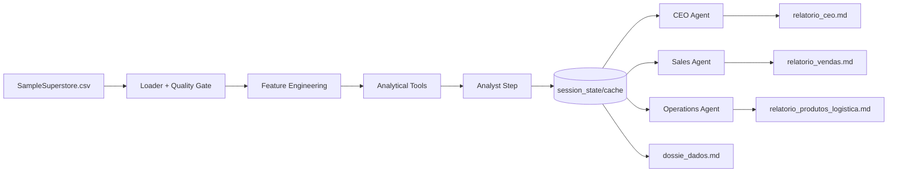

# Arquitetura do sistema multiagente

## Visão geral

O sistema separa três responsabilidades: **qualidade e transformação dos dados**, **cálculo determinístico** e **redação contextual por agentes**. Essa separação reduz alucinações numéricas e permite testar a maior parte do sistema sem consumir API.

## Componentes

### Quality Gate

`validate_columns()` verifica as colunas mínimas. `load_and_prepare_data()` trata encoding, datas, tipos numéricos, datas inválidas, vendas negativas, margem e divisão por zero.

### Tools

As ferramentas analíticas operam sobre pandas e são determinísticas:

- `get_executive_kpis()` calcula receita, lucro, margem, desconto, pedidos, clientes e tamanho da base;
- `get_performance_by_dimension()` agrupa por Região, Segmento ou Categoria;
- `get_product_and_shipping_diagnostics()` encontra subcategorias deficitárias e compara fretes;
- `get_temporal_trends()` calcula vendas, lucro, margem e crescimento mensal;
- `detect_anomalies()` identifica meses com vendas fora do desvio-padrão configurado;
- `filter_sales()` filtra período, região e vendedor, quando disponível.

As funções `executive_kpis_tool`, `performance_dimension_tool` e `diagnostics_tool` usam `@tool` quando o pacote Agno oferece o decorador; há fallback de identidade para permitir testes isolados.

### Workflow e session_state

`SuperstoreWorkflow` implementa o fluxo de forma explícita e cria `native_workflow`, uma instância do `agno.workflow.Workflow` quando a API está disponível. O método `run()` mantém uma camada de domínio testável e o objeto nativo formaliza a integração com Agno. O objeto `session_state` contém:

- `df`: dataframe preparado;
- `briefing`: dossiê consolidado;
- `reports`: resultados gerados;
- `metadata.cache`: cache de etapas intermediárias;
- `metadata.completed_steps`: trilha de execução.

O `analyst_step()` é idempotente: se o briefing estiver no cache, ele é reutilizado. A execução de relatórios recebe o mesmo dossiê e persiste os artefatos em `outputs/`.

### Agentes e fallback

Os agentes CEO, Sales e Operations são construídos sob demanda. O pipeline tenta modelos em ordem, repete erros transitórios 429/503 com backoff e troca imediatamente de modelo em 404/NOT_FOUND. O índice de modelo permanece no Workflow para as etapas seguintes.

## Decisões de qualidade

- Não permitir vendas negativas.
- Preencher margem como zero quando vendas forem zero, evitando `inf` e `NaN`.
- Falhar cedo com mensagem explícita quando faltarem colunas obrigatórias.
- Separar modo `dry_run` de modo LLM para validar o pipeline sem API.
- Manter relatórios e dados fora do versionamento por padrão.

## Evolução futura

A classe mantém uma interface compatível com uma eventual adoção do `agno.workflow.Workflow` nativo da versão escolhida. Como a API do Agno varia entre versões, os imports são compatíveis e a lógica de estado permanece no domínio do projeto, onde pode ser testada e auditada.
